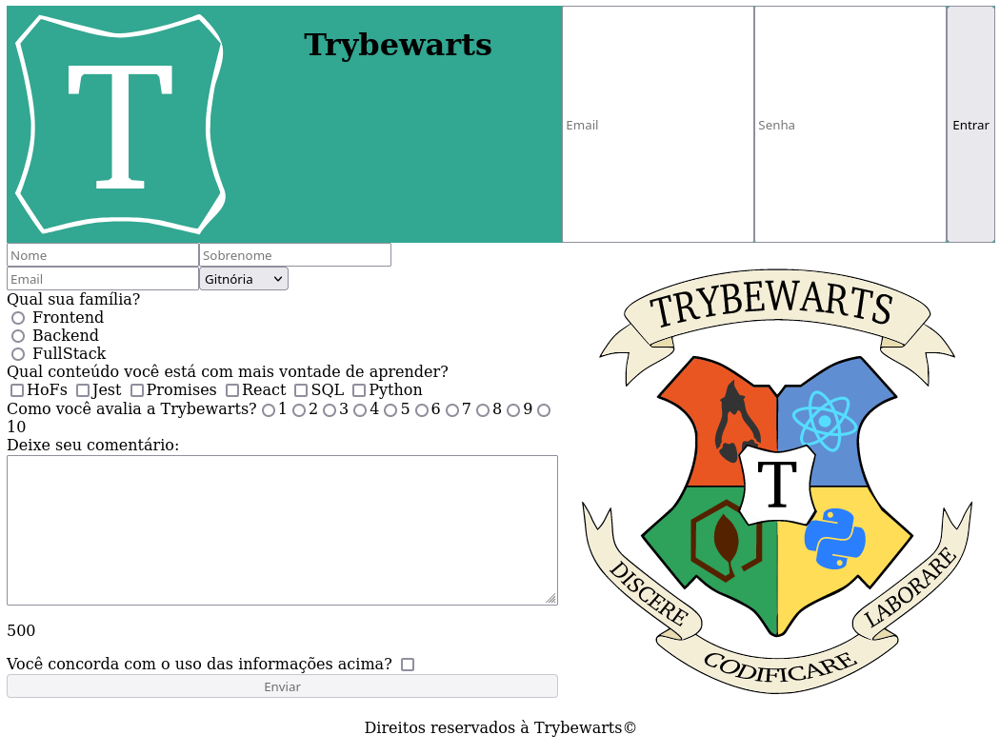

# Projeto Trybe - Trybewarts

Página de formulário da Escola de Magia de Trybewarts, em que as pessoas estudantes podem enviar seus feedbacks sobre ela. O tema desse projeto é baseado na obra 'Harry Potter', de J. K. Rowling, já que programar é o mais próximo que podemos chegar de algo verdadeiramente mágico!

Este foi o primeiro projeto em dupla da Trybe, nele praticamos o pair programing com o uso da extensão Live Share do Visual Studio Code.

#### Habilidades desenvolvidas durante o projeto
- Criar formulários em HTML;
- Utilizar CSS Flexbox para criar layouts flexíveis;
- Criar regras CSS específicas para serem aplicadas a dispositivos móveis;
- Construir páginas que alteram o seu layout de acordo com a orientação da tela;

Print da página:

